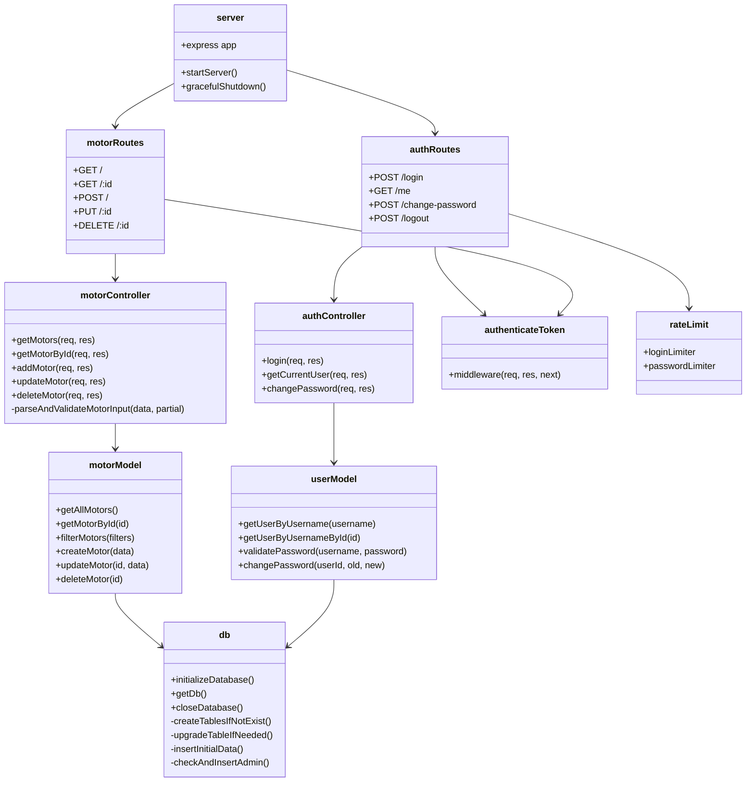
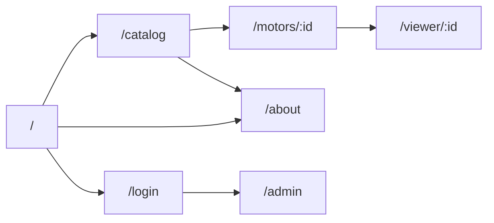
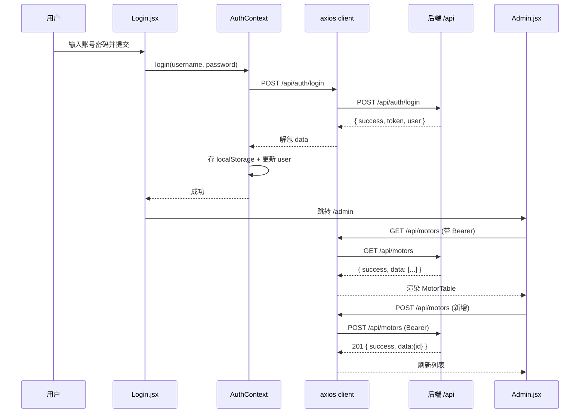
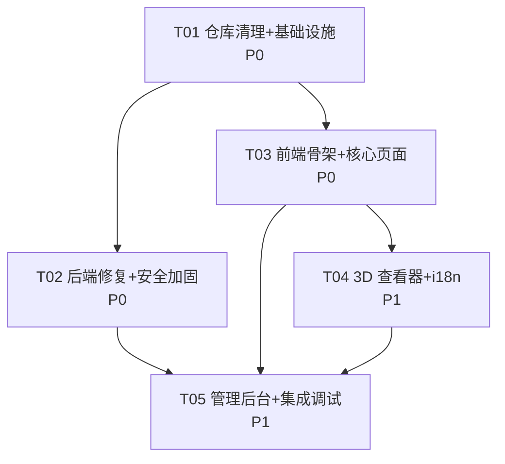

# NexMotor 架构评审与重建设计

> 作者：软件架构师 高见远（software-architect）
> 日期：2026-02-XX
> 范围：后端架构评估 + 后端修复设计 + 前端重建设计 + 任务分解（**仅设计，不含实现代码**）
> 复核依据：已逐一读取 backend 全部 9 个源文件、backend/package.json、frontend/package.json、frontend/vite.config.js、frontend/index.html、frontend/tailwind.config.js、frontend/postcss.config.js、README.md，并核对根目录残留与目录结构。

---

## 0. 结论摘要

| 维度 | 结论 |
|---|---|
| 后端 | 分层合理（routes→controllers→models→db），CRUD 完整可用；但**存在 2 个 P0 阻断级缺陷**（CORS 组合非法、HTTPS 双监听）、**3 个 P1 高风险项**（db.js Promise 竞态、默认管理员硬编码、无登录限流）及一批 P2/P3 可维护性问题。修复保持 API 契约不变。 |
| 前端 | `src/` 完全缺失（已核实仅剩 index.html + 4 个配置文件 + node_modules），**必须整体重建**。建议**保持 JavaScript（JSX）**，不引入 TypeScript（现有依赖栈无 TS、无 tsconfig，迁移成本大于收益）。需**新增 i18next + react-i18next**（README 声称已用 i18next，但 package.json 实际没有）。 |
| 仓库卫生 | 根目录残留完整 coze 模板项目（`package.json`、`next.config.ts`、`src/`、`public/`、`data/`、`scripts/` 等 14+ 项）与未解决 Git 冲突的 README，需整体清理。 |
| 交付物 | 本文档 + 任务列表（5 个任务，含依赖/负责人/验收标准）+ 类图/时序图/依赖图（Mermaid） |

---

## 1. 后端架构评估

### 1.1 分层与模块化评估

```
src/
├── server.js            启动 / HTTPS / 优雅关闭 / 全局异常
├── routes/              路由层（薄，仅做路径绑定 + 认证中间件挂载）
│   ├── authRoutes.js
│   └── motorRoutes.js
├── controllers/         控制器层（业务编排 + 参数校验 + 响应组装）
│   ├── authController.js
│   └── motorController.js
├── middleware/auth.js   JWT 认证中间件
└── models/              数据访问层（SQL 封装）
    ├── db.js            连接 / 建表 / 升级 / 种子
    ├── motorModel.js
    └── user.js
```

**优点**
- 三层结构清晰：路由薄、控制器管业务、模型管 SQL，职责边界基本正确。
- 路由与中间件复用良好（`authenticateToken` 统一挂载在写操作上）。
- SQL 全部使用参数化占位符（`?`），无字符串拼接注入风险。
- 排序字段使用白名单映射，防 SQL 注入。

**问题**
- **控制器过重**：`motorController.js` 中 addMotor/updateMotor 的数字校验逻辑重复约 100 行，属于典型的「复制粘贴式」代码。
- **数据层行为不完整**：`motorModel.filterMotors` 实际只消费 `power/rpm/efficiency` 范围 + 少量等值条件；控制器解析出的 `current_min / powerFactor_min / noise / mounting / connection` **在模型层被静默忽略**（见 B-01），导致「10+ 参数筛选」名不副实。
- **模型层混入调试输出**：生产环境打印完整 SQL 与参数（信息暴露）。
- **中间件安全不一致**：`middleware/auth.js` 存在 fallback secret，与 `server.js` 的强校验逻辑矛盾。
- **无测试**：零测试文件。

### 1.2 可维护性评分

| 维度 | 评分（1-5） | 说明 |
|---|---|---|
| 分层合理性 | 4 | 三层结构标准，边界清晰 |
| 模块化/复用 | 2 | 校验逻辑重复 100 行；authController 内联 require |
| 健壮性/错误处理 | 2 | db.js Promise 竞态；错误码依赖字符串匹配 |
| 安全性 | 2 | CORS 非法组合、默认口令、无限流、fallback secret |
| 可测试性 | 1 | 无任何测试 |
| 文档/配置完整性 | 2 | 无 .env.example；README 与实际技术栈严重不符 |
| **综合** | **2.2 / 5** | 功能可跑，但离「企业级」差距明显 |

### 1.3 问题清单总表（主理人清单验证 + 补充）

> 级别定义：**P0 = 阻断**（当前即导致功能/部署失败）；**P1 = 高**（安全风险或明显功能缺陷）；**P2 = 中**（健壮性/可维护性）；**P3 = 低**（卫生/文档）。

| # | 问题 | 级别 | 核实结论 |
|---|---|---|---|
| 1 | CORS `origin:'*'` + `credentials:true` 组合非法 | **P0** | ✅ 确认。浏览器规范禁止 `Access-Control-Allow-Origin: *` 与 `Access-Control-Allow-Credentials: true` 并存，带凭据请求会被拦截，前端登录/CRUD 全部失效 |
| 2 | server.js HTTPS 分支双监听 + `server = server || httpServer` 混乱 + 443 特权端口 | **P0** | ✅ 确认。生产有证书时会同时创建 https(443) 与 http(PORT) 两个 server；`server` 变量最后总被 HTTP server 覆盖，优雅关闭只关 HTTP |
| 3 | db.js `createTablesIfNotExist` Promise 在异步回调完成前 resolve；`upgradeTableIfNeeded` 依赖回调计数 | **P0** | ✅ 确认。`db.serialize` 内 `db.run` 回调未执行就先 `resolve()`；若建表失败 reject 会被吞掉，后续 insert 可能因表不存在而失败 |
| 4 | `insertInitialData` finalize 回调中 err 分支 reject 后仍继续执行 resolve + checkAndInsertAdmin（双重结算 + 副作用重复） | **P1** | ✅ 确认。err 时 Promise 已 settle，后续 `resolve()` 无效但 `checkAndInsertAdmin()` 仍会执行 |
| 5 | 默认管理员 admin/admin123 硬编码并打印日志 | **P1** | ✅ 确认。`db.js` L168-173 与 README 均写明默认口令 |
| 6 | 无登录限流（暴力破解风险） | **P1** | ✅ 确认。`/api/auth/login` 无任何频控 |
| 7 | 依赖过旧：express 4.18.2（path-to-regexp ReDoS CVE-2024-45296/45295）、jsonwebtoken 9.0.1、bcryptjs 2.4.3 | **P1** | ✅ 确认。express 需 ≥4.20.0；jsonwebtoken ≥9.0.2；bcryptjs 2.4.3 无已知严重 CVE，可保持或评估 3.x |
| 8 | getMotors 非法数字参数处理不当，NaN/非法字符串传入 SQL 返回空结果而非 400 | **P2** | ✅ 确认。`isNaN(query[field]) ? query[field] : Number(...)` 会把 `'abc'` 原样传入 SQL 参数 |
| 9 | addMotor/updateMotor 数字校验约 100 行重复代码 | **P2** | ✅ 确认。两函数几乎逐行相同 |
| 10 | authController 内联 require、废弃 verifyToken 死代码；middleware/auth.js 有 fallback secret | **P1** | ✅ 确认。fallback secret 属安全隐患（若 .env 缺失，任意签名可伪造 token），与 server.js 强校验矛盾 |
| 11 | 生产日志打印完整 SQL 与参数 | **P2** | ✅ 确认。`motorModel.js` L88-89 无条件 `console.log('SQL:', query)` |
| 12 | 无测试 | **P2** | ✅ 确认。backend 无任何 test 文件 |
| 13 | .env.example 不存在但 README 引用 | **P3** | ✅ 确认。backend 目录仅 .env |
| 14 | motorController 的 UNIQUE 判断依赖 SQLite 错误消息字符串 | **P2** | ✅ 确认。`error.message.includes('UNIQUE')`，应改用 `error.code` |
| **B-01** | **补充：筛选参数「解析但不消费」**——controller 解析 `current_min/powerFactor_min/noise/mounting/connection`，但 `filterMotors` 从未使用，前端传参被静默忽略 | **P1** | ✅ 新发现。`motorModel.filterMotors` 的 addCondition/addRange/addLike 覆盖列表中没有这些字段 |
| **B-02** | **补充：deleteMotor/getMotorById id 校验不一致**——getMotorById 校验 isNaN，deleteMotor 无校验；updateMotor 未校验 id | **P3** | ✅ 新发现。行为不一致但 SQLite 会安全处理 |
| **B-03** | **补充：`closeDatabase` 非 Promise**——gracefulShutdown 中 `await closeDatabase()` 实际不等回调 | **P3** | ✅ 新发现。关闭时序不严格 |
| **B-04** | **补充：README 严重失实**——声称 TypeScript/Sequelize/PostgreSQL/i18next 已完成，实际为 JS + 原生 SQL + SQLite + 无 i18n；且存在 Git 合并冲突标记 | **P2** | ✅ 新发现。需整体重写 |
| **B-05** | **补充：数据库含测试垃圾数据**——motors.db 含 model="1"/"666" 等测试行 | **P3** | ✅ 新发现（主理人侦察亦确认） |
| **B-06** | **补充：favicon 路径缺失**——index.html 引用 `/src/assets/logo/logo透明底蓝色1.png`，该目录不存在（404） | **P3** | ✅ 新发现 |
| **F-01** | **补充（前端）：package.json 无 i18next/react-i18next**，README 却称「已基于 i18next 完成完整翻译」 | **P1** | ✅ 新发现。重建需新增依赖 |
| **F-02** | **补充（前端）：无 TypeScript 配置**——无 tsconfig.json、无 typescript 依赖、无 @types/three | 决策项 | ✅ 新发现。影响技术栈选型（见 3.1） |

> 反驳/修正主理人清单：无实质反驳项；仅两点微调——#7 中 bcryptjs 2.4.3 无已知严重 CVE，升级优先级低于 express/jsonwebtoken；#12 无测试虽为 P2，但建议在修复任务中补最小冒烟测试（supertest）以保障回归。

---

## 2. 后端修复设计

### 2.1 修复原则

1. **API 契约不变**：URL、方法、请求/响应 JSON 结构（`success/data/message/total`）、HTTP 状态码语义均保持不变，前端无需因后端修复而改对接。
2. 唯一允许的**行为变化**：非法参数返回 `400`（此前返回 200 + 空结果），这是缺陷修复而非契约变更。
3. 每项修复限定文件与函数，**不做架构重构**（不引入 ORM、不拆分服务层），控制回归风险。
4. 新增依赖仅 2 个：`helmet`、`express-rate-limit`；`express`/`jsonwebtoken` 升级补丁版。

### 2.2 修复方案明细

| # | 问题 | 修改文件 | 具体方案 | 改动范围 |
|---|---|---|---|---|
| 1 | CORS 非法组合 | `src/server.js` | 移除 `credentials: true`；`origin` 改为：开发环境允许 `http://localhost:3000`（及 5173 兼容），生产读取 `CORS_ORIGIN`（逗号分隔白名单数组）。若确需跨域携带 cookie，才用白名单 + credentials；本项目 token 走 Authorization 头，**不需要 credentials** | 仅 `app.use(cors(...))` 一段 |
| 2 | HTTPS 双监听 | `src/server.js` | 重写启动分支：`let server; if (NODE_ENV==='production' && 证书存在) server = https.createServer(...).listen(443) else server = app.listen(PORT)`；**二选一，绝不双监听**；443 特权端口由部署层（nginx/systemd）处理，代码只做 if/else | `startServer()` 函数整体重写（约 30 行） |
| 3 | db.js Promise 竞态 | `src/models/db.js` | `createTablesIfNotExist`：改为 `db.serialize` 内串行 `db.run`，全部回调完成后再 `resolve`；任一失败立即 `reject` 且不再执行后续步骤。`upgradeTableIfNeeded`：先 `PRAGMA table_info(motors)` 查现有列，再只对缺失列逐个 `ALTER`，全部完成（或全部失败）后统一 resolve/reject；不再依赖计数器猜完成时机 | 两个函数整体重写（约 50 行） |
| 4 | 双重结算 | `src/models/db.js` | `insertInitialData`：`stmt.finalize` 回调中 `if (err) return reject(err);`（提前 return），成功分支再 `checkAndInsertAdmin` + `resolve`；同时把 `stmt.run` 循环改为逐个回调校验 | finalize 回调（约 10 行） |
| 5 | 默认管理员硬编码 | `src/models/db.js` | 改为：读取 `process.env.ADMIN_PASSWORD`；若未配置则生成 16 位随机密码（crypto.randomBytes），仅首次创建时打印一次并提示修改；README 同步删除默认口令描述。**保留 admin 用户名**避免破坏既有登录流程 | `checkAndInsertAdmin`（约 15 行） |
| 6 | 无登录限流 | `src/middleware/rateLimit.js`（新建）+ `src/routes/authRoutes.js` | 新增 `express-rate-limit`，对 `/login` 应用 `windowMs: 15min, max: 20`（按 IP）；对 `/change-password` 应用 `max: 10`；登录失败返回 `429 { success:false, message:'尝试过于频繁，请稍后再试' }` | 新建 1 文件 + authRoutes 挂载（约 15 行） |
| 7 | 依赖过旧 | `backend/package.json` | `express` → `^4.21.2`；`jsonwebtoken` → `^9.0.2`；`helmet` → `^8.0.0`（新增）；`express-rate-limit` → `^7.4.0`（新增）；`bcryptjs` 保持 `^2.4.3`（无 CVE，避免 3.x 迁移风险） | 仅 package.json |
| 8 | 非法数字参数 | `src/controllers/motorController.js` | `getMotors`：所有数字参数统一 `Number()` 后 `Number.isFinite()` 校验，非法即 `return 400 { success:false, message:'参数 xxx 必须是数字' }`；同时显式拒绝负数范围参数（power_min<0 等） | getMotors 参数解析段（约 25 行） |
| 9 | 校验代码重复 | `src/controllers/motorController.js` | 提取 `parseAndValidateMotorInput(data, { partial: boolean })` 模块内私有函数，返回 `{ ok, value|error }`；addMotor/updateMotor 共用；范围规则与现状一致（正数/0-100/0-1 等） | 新增 1 私有函数 + 两处调用替换（净 -80 行） |
| 10 | 死代码/fallback | `src/controllers/authController.js`、`src/middleware/auth.js` | authController：顶部统一 `const userModel = require('../models/user')`、`const bcrypt = require('bcryptjs')`；删除 `verifyToken` 导出与注释。middleware/auth.js：删除 `|| 'fallback-secret-for-dev-only'`，改为 `if (!process.env.JWT_SECRET) throw`（server.js 已有启动强校验，middleware 直接读取即可） | 两个文件各约 10 行 |
| 11 | 生产日志 | `src/models/motorModel.js` | 删除无条件 SQL/Params 打印；如需调试，改为 `if (process.env.LOG_SQL === 'true')` 条件打印 | filterMotors 尾部（约 5 行） |
| 12 | 无测试 | `test/api.test.js`（新建）+ `package.json` | 用 `node:test` + `supertest` 写冒烟测试：/health、GET /api/motors、筛选参数、登录成功/失败、鉴权保护（无 token 访问 POST /api/motors → 401）、非法参数 → 400；测试前临时指向测试数据库（`DB_PATH` 环境变量支持） | 新建 test 文件 + db.js 支持 DB_PATH（约 120 行） |
| 13 | .env.example | `backend/.env.example`（新建） | 模板含 JWT_SECRET/JWT_EXPIRES_IN/PORT/CORS_ORIGIN/ADMIN_PASSWORD/NODE_ENV，全部注释说明 | 新建 1 文件 |
| 14 | UNIQUE 字符串判断 | `src/controllers/motorController.js` | 改为 `error.code === 'SQLITE_CONSTRAINT_UNIQUE' || error.code === 'SQLITE_CONSTRAINT'` 判断 409 | addMotor catch（约 5 行） |
| B-01 | 筛选参数补全 | `src/models/motorModel.js` | `filterMotors` 增加：`addRange('current_min','current_max','current')`、`addRange('powerFactor_min','powerFactor_max','powerFactor')`、`addRange('noise_min','noise_max','noise')`、`addCondition('mounting', ...)`、`addCondition('connection', ...)`；排序白名单不变 | filterMotors（约 8 行） |
| B-02 | id 校验一致 | `src/controllers/motorController.js` | updateMotor/deleteMotor 增加与 getMotorById 相同的 `isNaN(id) → 400` | 两处（约 6 行） |
| B-03 | closeDatabase Promise | `src/models/db.js` | `closeDatabase` 返回 Promise，`db.close(cb)` 包一层；gracefulShutdown 真正等待 | db.js + server.js（约 10 行） |
| B-05 | 垃圾数据清理 | `data 清理` | 提供一次性清理脚本或手动 SQL 删除 model IN ('1','666') 的测试行；保留合法示例数据 | 运维操作 |

### 2.3 修复后后端文件清单

```
backend/
├── package.json            # 依赖升级 + test 脚本
├── .env.example            # 新建
├── .env                    # 保持不变（真实 JWT_SECRET 已在）
├── src/
│   ├── server.js           # CORS/HTTPS 修复 + helmet 挂载
│   ├── models/db.js        # Promise 竞态修复 + ADMIN_PASSWORD + DB_PATH
│   ├── models/motorModel.js# 筛选参数补全 + 日志收敛
│   ├── models/user.js      # 基本不动
│   ├── controllers/authController.js  # 清理死代码/内联 require
│   ├── controllers/motorController.js # 校验抽离 + 400 + UNIQUE code
│   ├── middleware/auth.js  # 去 fallback
│   ├── middleware/rateLimit.js        # 新建（限流）
│   └── routes/             # authRoutes 挂限流；motorRoutes 不变
└── test/api.test.js        # 新建冒烟测试
```

### 2.4 后端类图（修复后目标结构）



---

## 3. 前端重建设计

### 3.1 技术栈决策

**结论：保持 JavaScript（JSX），不引入 TypeScript。** 理由：

| 考量 | 说明 |
|---|---|
| 现状 | frontend/package.json 为纯 JS 栈：无 `typescript` 依赖、无 `tsconfig.json`、无 `@types/three`；README 的「TypeScript」为失实描述 |
| 迁移成本 | 引入 TS 需新增 typescript、@types/three、@types/node 等依赖并配置 tsconfig，且现有 node_modules 无 TS 编译链；对 30+ 新文件全部改 .tsx 成本高 |
| 收益 | 本项目规模小（≤40 文件）、无历史类型债务，JS + JSDoc 注释即可满足可维护性 |
| 未来 | 若后续需要，可平滑迁移（保留组件边界即可） |

**最终技术栈**（沿用现有依赖 + 2 个新增）：

```
Vite 5 + React 18 + JavaScript(JSX)
UI: Ant Design 5 + Tailwind CSS 3（tailwind 已配置完成）
3D: three 0.160 + @react-three/fiber 8.15 + @react-three/drei 9.99
路由: react-router-dom 6
HTTP: axios（vite 代理 /api → localhost:5000）
动画: framer-motion（可选，渐进增强）
国际化: i18next + react-i18next（新增依赖，package.json 缺失）
```

> 注意：`styled-components / tailwind-merge / clsx / lucide-react` 已在依赖中，保留供工程师按需使用；建议以 antd + Tailwind 为主，避免混用过多样式方案。

### 3.2 新增依赖（frontend/package.json）

```
- i18next@^23.11.0        : 国际化核心
- react-i18next@^14.0.0   : React 绑定
```

### 3.3 目录结构（总文件数 ≤ 40）

```
frontend/
├── index.html                    # 已有（微调：移除缺失 favicon 引用或指向 public/favicon.svg）
├── package.json                  # 已有（+i18next, react-i18next）
├── vite.config.js                # 已有（端口 3000、/api 代理 → 5000，不动）
├── tailwind.config.js            # 已有（不动）
├── postcss.config.js             # 已有（不动）
├── public/
│   └── favicon.svg               # 新建占位图标
└── src/
    ├── main.jsx                  # 入口：ConfigProvider(antd) + I18nProvider + Router
    ├── App.jsx                   # 路由表定义
    ├── index.css                 # 全局样式（Tailwind 指令 + 少量全局）
    ├── api/
    │   ├── client.js             # axios 实例 + 请求/响应拦截器（token 注入、401 处理）
    │   └── motors.js             # 电机 CRUD + 筛选参数构造
    ├── context/
    │   └── AuthContext.jsx       # 登录态 + token 持久化 + login/logout
    ├── hooks/
    │   └── useMotors.js          # 列表拉取 + 筛选状态管理（防抖、URL 同步可选）
    ├── i18n/
    │   ├── index.js              # i18next 初始化 + 语言持久化
    │   └── locales/
    │       ├── zh.js             # 中文翻译（约 120 键）
    │       └── en.js             # English translations
    ├── components/
    │   ├── layout/
    │   │   ├── AppLayout.jsx     # 全站布局（Header/Content/Footer + Outlet）
    │   │   ├── Header.jsx        # 导航 + 语言切换 + 登录状态
    │   │   └── Footer.jsx
    │   ├── motor/
    │   │   ├── MotorCard.jsx     # 列表卡片（型号/功率/转速/电压/效率）
    │   │   ├── FilterPanel.jsx   # 多维筛选面板（10+ 参数）
    │   │   ├── SpecTable.jsx     # 详情参数表（antd Descriptions）
    │   │   └── MotorTable.jsx    # 后台 CRUD 表格（antd Table + 行操作）
    │   ├── viewer3d/
    │   │   ├── Viewer3D.jsx      # Canvas 容器 + 控制栏（旋转/缩放/剖面/高亮）
    │   │   ├── MotorModel.jsx    # 占位电机模型（几何体组合）
    │   │   └── ModelControls.jsx # 剖面切换、部件高亮交互
    │   └── common/
    │       ├── LanguageSwitch.jsx# 中/英切换
    │       └── ProtectedRoute.jsx# 登录守卫（未登录重定向 /login）
    ├── pages/
    │   ├── Home.jsx              # 首页（Hero + 特性 + 快速入口）
    │   ├── Catalog.jsx           # 选型列表页（FilterPanel + 结果网格）
    │   ├── MotorDetail.jsx       # 详情页（参数表 + 3D 入口 + 图片）
    │   ├── Login.jsx             # 登录页
    │   ├── Admin.jsx             # 后台管理页（Tab：列表 CRUD / 新增编辑表单）
    │   └── About.jsx             # 关于页
    └── utils/
        ├── constants.js          # 筛选字段定义、排序选项、单位映射
        └── format.js             # 数字/单位/参数格式化
```

**文件数统计**：配置 5 + public 1 + src 30 = **36 个**（≤ 40 ✅）

### 3.4 页面清单与路由

| 路由 | 页面 | 访问控制 | 说明 |
|---|---|---|---|
| `/` | Home | 公开 | 品牌 Hero、核心特性、入口按钮 |
| `/catalog` | Catalog | 公开 | 核心选型页：筛选面板 + 结果网格 + 排序 |
| `/motors/:id` | MotorDetail | 公开 | 电机详情 + 规格表 + 「3D 查看」入口 |
| `/viewer/:id` | Viewer3D（复用 MotorDetail 内嵌或独立页） | 公开 | 全屏 3D 查看器（旋转/缩放/剖面/高亮） |
| `/login` | Login | 公开 | 登录表单 |
| `/admin` | Admin | 需登录（ProtectedRoute） | 后台 CRUD |
| `/about` | About | 公开 | 项目介绍 |
| `*` | 404 页 | 公开 | 兜底 |



### 3.5 状态管理方案

- **AuthContext**：全局唯一 Context。状态 `{ user, token, loading }`；`login()` 调 `/api/auth/login` 后写入 `localStorage('nexmotor_token')` 并更新 user；`logout()` 清除；应用启动时读取 token 并调用 `/api/auth/me` 恢复会话（失败则清除）。
- **useMotors hook**：列表页本地状态 `{ filters, sortBy, data, loading, error }`；筛选变化时（防抖 300ms）构造 query 调 `GET /api/motors`；支持重置。
- 其他页面状态用组件本地 `useState`，不引入 Redux/Zustand（规模小，Context 足够）。
- **antd 语言**：ConfigProvider `locale` 随 i18n 语言切换（`zhCN`/`enUS`）。

### 3.6 前后端 API 对接契约

**BaseURL**：axios 实例 `baseURL: import.meta.env.VITE_API_BASE || '/api'`。开发环境经 vite 代理（`/api` → `http://localhost:5000`）；生产环境建议同域部署或配置 `VITE_API_BASE`。

**统一响应结构**（后端契约，前端 axios 拦截器解包 `res.data`）：
```
成功: { success: true, data: ..., total?: number, message?: string }
失败: { success: false, message: string }
```

**Token 传递**：请求拦截器从 localStorage 读取，注入 `Authorization: Bearer <token>`；响应拦截器遇 401 清除 token 并跳转 /login。

**筛选参数映射**（GET /api/motors，前端 FilterPanel → query）：

| UI 筛选项 | Query 参数 | 后端操作 | 现状 | 修复后 |
|---|---|---|---|---|
| 功率区间 (kW) | `power_min` / `power_max` | `power >= ? AND power <= ?` | ✅ | ✅ |
| 电压 (V) | `voltage` | `voltage = ?` | ✅ | ✅ |
| 转速区间 (rpm) | `rpm_min` / `rpm_max` | `rpm >= ? AND rpm <= ?` | ✅ | ✅ |
| 机座号 | `frameSize` | `frameSize = ?` | ✅ | ✅ |
| 效率下限 (%) | `efficiency_min` | `efficiency >= ?` | ✅ | ✅ |
| 极数 | `poles` | `poles = ?` | ✅ | ✅ |
| 频率 (Hz) | `frequency` | `frequency = ?` | ✅ | ✅ |
| 防护等级 | `ip` | `ip = ?` | ✅ | ✅ |
| 绝缘等级 | `insulation` | `insulation = ?` | ✅ | ✅ |
| 安装方式 | `mounting` | `mounting = ?` | ❌ 被忽略 | ✅（B-01 修复） |
| 接法 | `connection` | `connection = ?` | ❌ 被忽略 | ✅（B-01 修复） |
| 额定电流区间 (A) | `current_min` / `current_max` | `current >= ? AND current <= ?` | ❌ 被忽略 | ✅（B-01 修复） |
| 功率因数下限 | `powerFactor_min` | `powerFactor >= ?` | ❌ 被忽略 | ✅（B-01 修复） |
| 噪声上限 (dB) | `noise_max` | `noise <= ?` | ❌ 被忽略 | ✅（B-01 修复） |
| 型号关键字 | `model` | `model LIKE %?%` | ✅ | ✅ |
| 描述关键字 | `description` | `description LIKE %?%` | ✅ | ✅ |
| 排序 | `sortBy` | 白名单映射 | ✅ | ✅ |

**鉴权接口**：
```
POST /api/auth/login          { username, password } → { success, token, user:{id,username,role} }
GET  /api/auth/me             Bearer → { success, user }
POST /api/auth/change-password Bearer { oldPassword, newPassword } → { success, message }
POST /api/auth/logout         Bearer → { success, message }
```

**电机写操作**（均需 Bearer）：
```
POST   /api/motors        body: 电机对象（model/frameSize/power/voltage/rpm 必填）
PUT    /api/motors/:id    body: 部分字段
DELETE /api/motors/:id
```

### 3.7 3D 查看器实现方案

- **渲染**：`@react-three/fiber` Canvas + `@react-three/drei` 的 `OrbitControls`（旋转/缩放）、`Environment`（环境光反射）、`ContactShadows`（地面投影）、`Html`（部件标注）。
- **占位模型**：用基础几何体组合表现电机外观，**明确标注为占位模型**（非真实产品）：
  - 机壳：圆柱体（横向），金属材质（`MeshStandardMaterial` metalness≈0.9, roughness≈0.35）；
  - 前后端盖：两个稍小圆柱/圆盘；
  - 风罩：端部栅格圆环（`torus` + 细柱阵列）或简化圆台；
  - 接线盒：机壳上方小盒子；
  - 底座：扁平盒子 + 安装孔（`cylinder` 数组）。
- **交互**：
  - 旋转/缩放：OrbitControls（默认开启，限制极角/距离）；
  - 剖面：切换「外壳半剖」显示（隐藏前半部网格组，暴露内部转子圆柱，转子可用不同颜色区分）；
  - 部件高亮：hover/点击部件设置 `emissive` 高亮 + `Html` 标签显示部件名（机壳/转子/风罩/接线盒/底座）。
- **性能**：`dpr={[1,2]}`、`frameloop="demand"` 降低开销。
- **数据**：模型尺寸/颜色不随电机参数变化（本期占位）；预留 `motor` prop，未来可映射真实比例或 GLB 模型。

### 3.8 i18n 方案

- **初始化**：`src/i18n/index.js` 用 i18next 初始化，`resources: { zh: {...}, en: {...} }`，`lng` 读取 `localStorage('nexmotor_lang')` 或浏览器语言，`fallbackLng: 'zh'`。
- **使用**：组件内 `useTranslation()` 取 `t('key')`；`LanguageSwitch` 调用 `i18n.changeLanguage(lng)` 并同步 localStorage + `document.documentElement.lang` + antd `ConfigProvider locale`。
- **翻译文件**：zh.js / en.js 各约 120 键，按命名空间分组：`common`（导航/按钮）、`home`、`catalog`、`detail`、`viewer`、`auth`、`admin`、`about`、`errors`。
- **参数/复数**：筛选标签、单位（kW/A/rpm）通过翻译模板 + 常量表输出。

### 3.9 前端时序图（登录 → 后台 CRUD 主流程）



---

## 4. 任务列表（按实现顺序，负责人：engineer）

> 分组原则：仓库清理与基础设施 → 后端修复 → 前端骨架+核心页面 → 3D+i18n → 管理后台+集成。每任务 ≥3 个相关文件；T02 与 T03 仅依赖 T01，可并行；其余线性依赖。

### T01 仓库清理 + 项目基础设施

| 项 | 内容 |
|---|---|
| **源文件** | 删除根目录 coze 残留（`package.json`、`next.config.ts`、`next-env.d.ts`、`components.json`、`eslint.config.mjs`、`tsconfig.json`、`postcss.config.mjs`、`pnpm-lock.yaml`、`.coze`、`TROUBLESHOOTING_DASHBOARD.md`、`data/`、`public/`、`scripts/`、`src/`）；重写 `README.md` 为 NexMotor 单项目文档（消除 Git 冲突标记，技术栈按实际 JS/Express/SQLite 描述）；新建 `backend/.env.example`；`frontend/package.json` 增加 `i18next`、`react-i18next` 并安装；`frontend/public/favicon.svg` 占位图标；`frontend/index.html` 移除失效 favicon 引用（或指向新图标） |
| **依赖** | 无（T01 自身为基座） |
| **优先级** | P0 |
| **负责人** | engineer |
| **验收标准** | ① 根目录仅剩 `backend/ frontend/ docs/ LICENSE README.md .gitignore .npmrc`；② README 无 `<<<<<<<` 冲突标记且与实际技术栈一致；③ `npm i` 后 frontend 可 `npm run dev` 启动（虽有 404 但无编译错误）；④ backend/.env.example 存在且含全部配置项说明 |

### T02 后端修复与安全加固（+ 冒烟测试）

| 项 | 内容 |
|---|---|
| **源文件** | `backend/src/server.js`（CORS/HTTPS 分支/helmet）、`backend/src/models/db.js`（Promise 竞态/ADMIN_PASSWORD/DB_PATH/closeDatabase）、`backend/src/models/motorModel.js`（筛选补全/日志收敛）、`backend/src/controllers/motorController.js`（校验抽离/非法参数 400/UNIQUE code/id 校验）、`backend/src/controllers/authController.js`（死代码清理）、`backend/src/middleware/auth.js`（去 fallback）、`backend/src/middleware/rateLimit.js`（新建）、`backend/src/routes/authRoutes.js`（挂限流）、`backend/package.json`（依赖升级）、`backend/.env.example`（若 T01 未做则在此）、`backend/test/api.test.js`（新建） |
| **依赖** | T01 |
| **优先级** | P0 |
| **负责人** | engineer |
| **验收标准** | ① 全部既有接口（/health、/api/motors、/api/auth/login、CRUD）行为不变；② 非法数字筛选参数返回 400；③ `npm test` 冒烟测试全绿；④ 生产模式（NODE_ENV=production + 证书存在）仅监听一个端口；⑤ 15 分钟内同 IP 登录失败超 20 次返回 429；⑥ motors.db 测试垃圾数据（model="1"/"666"）已清理；⑦ 启动日志不再打印默认口令；⑧ 响应头含 `X-Content-Type-Options` 等 helmet 头 |

### T03 前端骨架 + 核心业务页面

| 项 | 内容 |
|---|---|
| **源文件** | `frontend/src/main.jsx`、`frontend/src/App.jsx`、`frontend/src/index.css`、`frontend/src/api/client.js`、`frontend/src/api/motors.js`、`frontend/src/context/AuthContext.jsx`、`frontend/src/hooks/useMotors.js`、`frontend/src/utils/constants.js`、`frontend/src/utils/format.js`、`frontend/src/components/layout/AppLayout.jsx`、`frontend/src/components/layout/Header.jsx`、`frontend/src/components/layout/Footer.jsx`、`frontend/src/components/common/ProtectedRoute.jsx`、`frontend/src/components/motor/MotorCard.jsx`、`frontend/src/components/motor/FilterPanel.jsx`、`frontend/src/components/motor/SpecTable.jsx`、`frontend/src/pages/Home.jsx`、`frontend/src/pages/Catalog.jsx`、`frontend/src/pages/MotorDetail.jsx`、`frontend/src/pages/About.jsx` |
| **依赖** | T01（联调依赖 T02，故标注 T02 为软依赖） |
| **优先级** | P0 |
| **负责人** | engineer |
| **验收标准** | ① `/`、`/catalog`、`/motors/:id`、`/about` 可访问且响应式（桌面/平板/手机）；② FilterPanel 的 14 个筛选项全部生效并正确映射到 query 参数（对照 3.6 表）；③ 列表/详情从真实后端取数渲染；④ Header 显示登录态（未登录显示「登录」入口）；⑤ 中文文案完整（i18n 替换在 T04） |

### T04 3D 查看器 + 国际化

| 项 | 内容 |
|---|---|
| **源文件** | `frontend/src/components/viewer3d/Viewer3D.jsx`、`frontend/src/components/viewer3d/MotorModel.jsx`、`frontend/src/components/viewer3d/ModelControls.jsx`、`frontend/src/i18n/index.js`、`frontend/src/i18n/locales/zh.js`、`frontend/src/i18n/locales/en.js`、`frontend/src/components/common/LanguageSwitch.jsx`、`frontend/src/pages/MotorDetail.jsx`（接入 Viewer3D 入口）、`frontend/src/main.jsx`（挂 ConfigProvider locale） |
| **依赖** | T03 |
| **优先级** | P1 |
| **负责人** | engineer |
| **验收标准** | ① `/viewer/:id` 或详情页内嵌 3D 可渲染占位电机模型（机壳/端盖/风罩/接线盒/底座）；② 旋转/缩放正常，剖面开关可隐藏外壳露出转子，hover 部件有高亮与标签；③ 页面标注「演示模型」；④ 中英切换全站生效（导航/筛选/详情/3D 控制/登录页），刷新后语言保持；⑤ antd 组件语言随切换同步；⑥ `document.documentElement.lang` 同步 |

### T05 管理后台 + 集成调试

| 项 | 内容 |
|---|---|
| **源文件** | `frontend/src/pages/Login.jsx`、`frontend/src/pages/Admin.jsx`、`frontend/src/components/motor/MotorTable.jsx`、`frontend/src/App.jsx`（挂 /admin 与 /login、受保护路由）、`frontend/src/api/motors.js`（写操作封装）、`frontend/src/context/AuthContext.jsx`（登录态恢复完善） |
| **依赖** | T02、T03、T04 |
| **优先级** | P1 |
| **负责人** | engineer |
| **验收标准** | ① 未登录访问 /admin 重定向 /login；② 登录成功后进入后台；③ 电机新增/编辑/删除全流程可用，表单校验与后端 400/409 提示一致；④ 修改密码入口可用；⑤ 退出登录清除 token 并回登录页；⑥ 全站中英双语、响应式、无控制台报错；⑦ `npm run build` 通过 |

### 任务依赖图



---

## 5. 风险与待明确事项

| # | 事项 | 类型 | 建议/说明 |
|---|---|---|---|
| 1 | 3D 模型为**占位几何体**，非真实电机外观 | 需求 | README 声称「完整 3D 模型，支持旋转、缩放、剖面、细节高亮」——本期以占位模型实现交互能力；真实 GLB 模型需单独提供资产，建议列为二期 |
| 2 | 后台「批量导入导出、图片管理、权限控制」后端无对应接口 | 需求 | 现有后端仅支持 CRUD + JWT；批量导入导出（CSV/Excel）、图片上传存储、多角色权限（admin/viewer 等）需新增接口与文件存储方案，建议分期：本期先做单角色 CRUD，其余列入二期 |
| 3 | 登录成功后 token 有效期（默认 7d）与「记住我」策略 | 产品 | 默认 localStorage 持久化；若要求会话级，可改 sessionStorage。需产品确认 |
| 4 | 生产部署拓扑 | 运维 | HTTPS 证书路径（src/ssl 约定）、CORS_ORIGIN 白名单、443 端口由反向代理承担；建议部署时 NODE_ENV=production + nginx |
| 5 | motors.db 数据迁移策略 | 数据 | 现有 9 条数据含垃圾行（model="1"/"666"）；是否保留示例数据、是否需要批量导入真实电机数据，需确认。建议保留合法示例 + 清理垃圾行 |
| 6 | 根目录 `.gitignore` / `.npmrc` 归属 | 卫生 | `.npmrc` 疑似 coze 模板（可能强制 pnpm），删除根 package.json 后建议一并清理或确认内容；`.gitignore` 建议保留并补充 backend/frontend 忽略项 |
| 7 | TypeScript 迁移 | 技术债 | 本期明确 JS；若后续团队规范要求 TS，需单独排期（迁移成本约 +2 天） |
| 8 | 测试覆盖深度 | 质量 | 本期仅后端冒烟测试（node:test + supertest）；前端组件测试（Vitest + RTL）与更全面后端用例建议二期补齐 |
| 9 | 后端 bcryptjs 版本 | 依赖 | 保持 2.4.3（无 CVE）；若未来需要 bcrypt（原生）再评估 |
| 10 | 前端 404 页 | 体验 | 路由 `*` 兜底页本期用简单文案，设计稿后续补充 |
